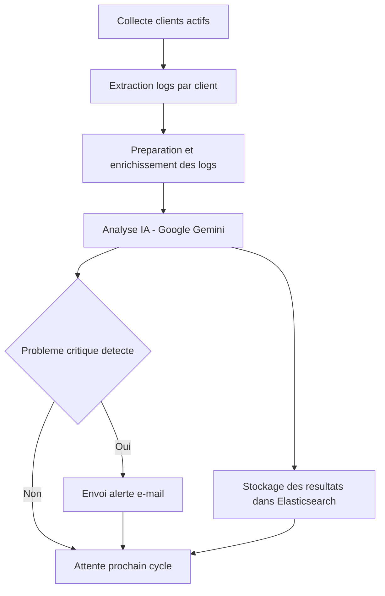

# IA Log Analyzer


Analyseur de journaux automatisé avec Intelligence Artificielle (IA) et alertes, conçu pour surveiller, résumer et détecter les incidents critiques dans vos logs applicatifs ou systèmes.

## 🚀 Fonctionnalités principales

- **Collecte automatique** des logs depuis Elasticsearch
- **Détection intelligente** d'incidents, erreurs, problèmes de sécurité ou de performance via IA (Google Gemini)
- **Alertes automatiques** par e-mail en cas de problème critique
- **Gestion d'état** pour chaque client (pas de doublons, continuité assurée)
- **Enrichissement des résultats** (métadonnées, échantillons, etc.) pour faciliter l'analyse dans Kibana
- **Configuration flexible** via variables d'environnement

## 🛠️ Prérequis

- Python 3.8+
- Pile **ELK (Elasticsearch + Kibana + Filebeat/Logstash) installée et fonctionnelle – OBLIGATOIRE**
  - Testé avec Elasticsearch 8/9.
  - Les logs doivent être ingérés (ex: via Filebeat → `filebeat-*`).
- Une clé API **Google Gemini** (https://aistudio.google.com/app/apikey)
- Accès SMTP pour l'envoi d'e-mails (optionnel)

### ✅ Vérification rapide de l'environnement ELK

1. Vérifier Elasticsearch est UP:
   ```bash
   curl -s http://localhost:9200 | jq . # ou simplement curl http://localhost:9200
   ```
2. Vérifier un index de logs existe (ex: Filebeat):
   ```bash
   curl -s http://localhost:9200/_cat/indices/filebeat-*?v
   ```
3. Vérifier l'accès à Kibana: `http://localhost:5601` (ou l’URL de votre instance)

## 📦 Installation

1. Clonez le dépôt :
   ```bash
   git clone https://github.com/Demonshuraisha/ia-log-analyzer.git
   
   cd ia-log-analyzer
   ```
2. Créez un environnement virtuel et activez-le :
   ```bash
   python -m venv env
   source env/bin/activate  # ou .\env\Scripts\activate sous Windows
   ```
3. Installez les dépendances :
   ```bash
   pip install -r requirements.txt
   ```

## ⚙️ Configuration

Créez un fichier `.env` (ou exportez les variables d'environnement) avec les paramètres suivants :

```env
# Elasticsearch
ES_HOST=http://localhost:9200
ES_USER=elastic
ES_PASSWORD=changeme
LOG_INDEX_PATTERN=filebeat-*
ANALYSIS_STATE_INDEX=ia-analysis-state
IA_RESULTS_INDEX=ia-analysis-results
CLIENT_ID_FIELD=host.name.keyword

# API IA
GEMINI_API_KEY=sk-xxxxxxx

# Script
ANALYSIS_INTERVAL_SECONDS=300
MAX_LOGS_PER_BATCH=50
INITIAL_LOOKBACK_SECONDS=3600
ACTIVE_CLIENTS_LOOKBACK_TIME=24h

# Notifications e-mail
ENABLE_EMAIL_NOTIFICATIONS=True
SMTP_SERVER=smtp.example.com
SMTP_PORT=587
SMTP_USERNAME=monuser
SMTP_PASSWORD=monpass
EMAIL_FROM=ia-analyzer@yourdomain.com
EMAIL_TO=admin@yourdomain.com
EMAIL_SUBJECT_PREFIX=[IA Log Analyzer Alert]
ALERT_SEVERITIES=critical,high
```

## 🏃 Exemple d'utilisation

Lancez simplement le script principal :

```bash
python main.py
```

Le script tourne en boucle, analyse les logs pour chaque client actif, envoie les résultats dans Elasticsearch et alerte par e-mail si besoin.

### Exécution en tant que service

Linux (systemd):
```ini
[Unit]
Description=IA Log Analyzer
After=network.target

[Service]
Type=simple
WorkingDirectory=/opt/ia-log-analyzer
EnvironmentFile=/opt/ia-log-analyzer/.env
ExecStart=/usr/bin/python3 /opt/ia-log-analyzer/main.py
Restart=always
RestartSec=10

[Install]
WantedBy=multi-user.target
```

Windows (Task Scheduler):
- Créer une tâche planifiée qui démarre au boot, action: `python.exe C:\path\to\ia-log-analyzer\main.py`, définir le répertoire de démarrage.

### 🔍 Validation rapide après exécution

- Dans Kibana → Discover, vérifiez l’index `ia-analysis-results`.
- Filtrez par `client_id` et par `@timestamp` récent.
- En cas d'alerte, surveillez la boîte mail configurée.

## 🔄 Schéma du workflow




## 📄 Licence

Sous licence MIT (voir `LICENSE`).

## 🤝 Contribution & contact

Les contributions sont les bienvenues !

- Auteur : Unamed
- Contact : via Github
- Issues & suggestions : via GitHub

---

## ❓ FAQ

**Q : Le script ne se connecte pas à Elasticsearch, que faire ?**  
R : Vérifiez l'URL, le port, les identifiants et que le service Elasticsearch est bien démarré. Consultez les logs pour plus de détails.

**Q : Comment tester l'envoi d'e-mails d'alerte ?**  
R : Activez `ENABLE_EMAIL_NOTIFICATIONS`, configurez correctement le SMTP et déclenchez une alerte critique (ex : insérez un log simulant une erreur critique).

**Q : Comment changer la fréquence d'analyse ?**  
R : Modifiez la variable d'environnement `ANALYSIS_INTERVAL_SECONDS` (en secondes) dans votre fichier `.env`.

**Q : Peut-on utiliser une autre IA que Google Gemini ?**  
R : Le code est modulaire, il suffit d'adapter le module `core/ia_api_handler.py` pour intégrer une autre API IA.

**Q : Où trouver les résultats d'analyse ?**  
R : Les résultats sont stockés dans l'index Elasticsearch défini par `IA_RESULTS_INDEX` (par défaut : `ia-analysis-results`).

---

## 📝 Changelog

### v1.0.0 (Initial release)
- Première version stable de l'analyseur IA de logs
- Collecte automatique des logs par client
- Analyse IA (Google Gemini) et enrichissement des résultats
- Alertes e-mail en cas de problème critique
- Gestion d'état d'analyse par client
- Configuration flexible via variables d'environnement
